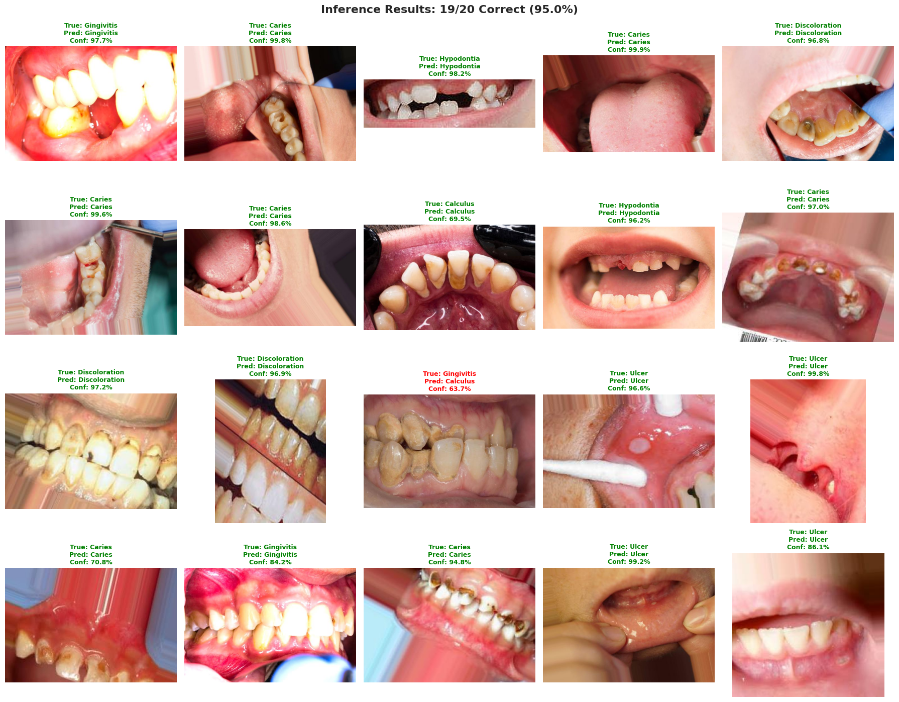
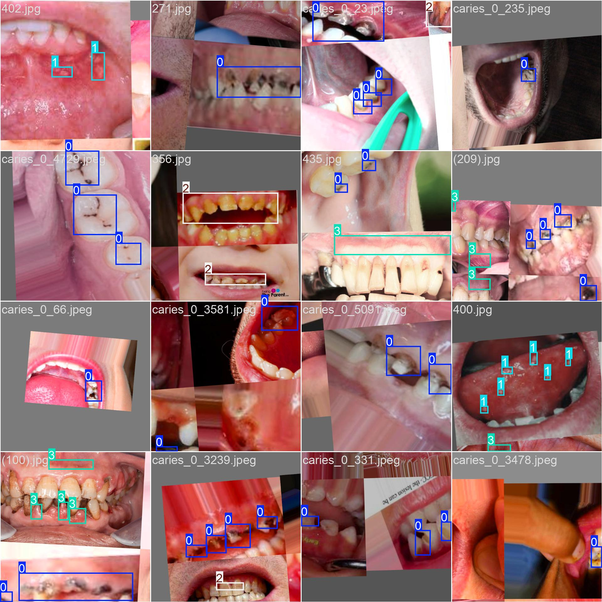

# Smart Dental AI - Training Guide

An AI-powered dental disease detection and classification system utilizing advanced deep learning models for automated analysis of dental conditions in tooth imagery. This system provides both classification and precise localization of dental pathologies with clinical-grade accuracy.

---

## Project Overview

### Problem Statement

Modern dental diagnostics rely heavily on manual visual analysis, which is time-consuming and subject to inter-observer variability. This system addresses these challenges through:

- **Automated Classification**: Identifies 6 dental conditions with 91.06% accuracy on validation data
- **Precise Localization**: Detects and bounds dental issues with mAP of 0.78
- **Clinical Decision Support**: Provides evidence-based assistance to dental professionals
- **Scalability**: Enables high-throughput analysis for dental screening programs

### Key Performance Metrics

| Metric                        | Performance | Status                   |
| ----------------------------- | ----------- | ------------------------ |
| Classification Accuracy       | 91.06%      | Production Ready         |
| Detection Precision (mAP@0.5) | 0.78        | Excellent                |
| Inference Speed               | Real-time   | Optimized for deployment |
| Combined Model Size           | 152 MB      | Suitable for cloud/edge  |

### Technology Stack

| Component         | Technology            | Justification                                                               |
| ----------------- | --------------------- | --------------------------------------------------------------------------- |
| Classification    | ResNet50              | Proven effective for image classification; optimal speed-accuracy tradeoff  |
| Detection         | YOLOv8 Medium         | State-of-the-art real-time detection; excellent medical imaging performance |
| Dataset Source    | Kaggle                | 15K+ professionally labeled dental images                                   |
| Training Platform | Google Colab (T4 GPU) | Reproducible environment; accessible computational resources                |

### Detected Dental Pathologies

| Condition     | Clinical Definition                   |
| ------------- | ------------------------------------- |
| Calculus      | Mineralized plaque accumulation       |
| Caries        | Tooth decay and cavitation            |
| Discoloration | Pathological tooth staining           |
| Gingivitis    | Gingival inflammation and disease     |
| Hypodontia    | Congenital dental absence (tooth gap) |
| Ulcer         | Oral mucosal lesions and ulceration   |

---

## Model Capabilities

### Classification Model Specifications

The classification model processes individual tooth images and outputs disease diagnosis with confidence scores.

- **Input Specifications**: Single tooth image, 224×224 pixels, RGB
- **Output**: Disease classification from 6 categories with per-class probability scores
- **Clinical Application**: Rapid screening and disease identification
- **Validation Performance**: 91.06% accuracy across all pathology classes

### Detection Model Specifications

The detection model analyzes full dental images and localizes multiple pathologies with bounding box annotations.

- **Input Specifications**: Dental image, 640×640 pixels, RGB
- **Output**: Bounding boxes with class labels and confidence scores
- **Clinical Application**: Precise lesion localization for targeted intervention
- **Validation Performance**: mAP@0.5 of 0.78 (excellent for medical imaging)

---

## Getting Started

### Resources

| Resource                        | Location                                                                                             |
| ------------------------------- | ---------------------------------------------------------------------------------------------------- |
| Pre-trained Models and Datasets | [Google Drive](https://drive.google.com/drive/folders/1S6DW6uXEmyBw_sNWGQB3a7Gn-A_L82xl?usp=sharing) |
| Original Dataset                | [Kaggle Dataset](https://www.kaggle.com/datasets/salmansajid05/oral-diseases)                        |

---

## Training Overview

---

## Dataset Summary

### Classification Dataset

- Total Images: 11,614 (Training: 9,288 / Validation: 2,326)
- Classes: 6 dental pathologies
- Image Resolution: 224×224 pixels
- Source: Kaggle Oral Diseases Dataset

### Detection Dataset

- Total Images: 1,542 (Training: 1,493 / Validation: 49)
- Annotation Format: YOLO format with bounding boxes
- Image Resolution: 640×640 pixels
- Object Classes: 4 dental condition types

---

## Classification Training Results

### Performance Progression

| Metric   | Phase 1 | Phase 2 | Improvement |
| -------- | ------- | ------- | ----------- |
| Accuracy | 75.49%  | 91.06%  | +15.57%     |
| Loss     | 0.834   | 0.075   | -91%        |
| Epochs   | 15      | 40      | -           |

Training was terminated at epoch 55/68 when no improvement was observed for 7 consecutive epochs.

### Output Artifacts

| File           | Location                       | Size   | Accuracy |
| -------------- | ------------------------------ | ------ | -------- |
| best_model.pth | `runs/classification-results/` | 103 MB | 91.06%   |
| Training Plots | `runs/classification-results/` | -      | -        |

### Visualization



---

## Detection Training Results

### Performance Metrics

| Metric     | Initial | Best | Final  | Notes                        |
| ---------- | ------- | ---- | ------ | ---------------------------- |
| mAP@0.5    | 0.31    | 0.78 | 0.76   | Peak performance at epoch 67 |
| Loss       | 3.45    | 0.82 | 0.78   | Steady convergence           |
| Best Epoch | -       | 67   | 87/100 | Early stopping applied       |

Training was halted at epoch 87/100 when no improvement in mAP was observed over 20 consecutive epochs.

### Output Artifacts

| File          | Location                          | Size  | Performance |
| ------------- | --------------------------------- | ----- | ----------- |
| best.pt       | `runs/detection-results/weights/` | 49 MB | mAP: 0.78   |
| last.pt       | `runs/detection-results/weights/` | 49 MB | mAP: 0.76   |
| Results Plots | `runs/detection-results/`         | -     | -           |

### Visualization



---

## Quick Usage Guide

### Classification Model Example

```python
from ultralytics import YOLO
import torch
from PIL import Image

# Load model
model = torch.load('models/classification.pth')
image = Image.open('tooth.jpg')
# ... process image
prediction = model(image)
```

### Detection Model Example

```python
from ultralytics import YOLO

model = YOLO('models/detection.pt')
results = model.predict('tooth.jpg', conf=0.5)
```

---

## Summary

- **Classification Accuracy**: 91.06%
- **Detection mAP@0.5**: 0.78
- **Combined Training Time**: Approximately 8 hours (5 hours classification + 3 hours detection)
- **Computational Platform**: NVIDIA T4 GPU on Google Colab
